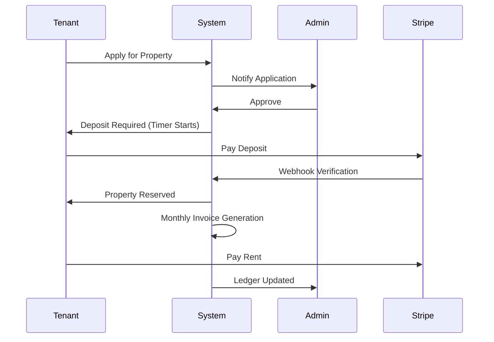

<!-- ===================== HERO SECTION ===================== -->

<h3>Full Stack Software Engineer • Production SaaS Builder</h3>

Payments • Automation • Scalable Systems • Real-World Workflows

<!-- Animated typing line -->

 

<!-- Badges -->

---

## 🧠 Engineering Mindset

> **Business logic belongs in code, not spreadsheets or reminders.**  
> I design backend-first systems where:
- payments are verifiable  
- workflows are enforced automatically  
- scaling does **not** require rewrites  
- failures are traceable via logs & ledgers  

---

## 🚀 Flagship Project — **LeaseHub (Production SaaS)**

### Why LeaseHub exists
Most property platforms rely on **manual approvals, reminders, and trust**.

**LeaseHub replaces trust with systems.**

### What makes it different
✔ No manual rent tracking  
✔ No admin-created invoices  
✔ No silent payment failures  
✔ No orphaned properties  

Everything is **time-driven, automated, and auditable**.

---
## 🔄 Real-World Workflow (Animated Explanation)

---

## 🧩 System Thinking (What I Build)

  

---

## 🛠️ Technology Stack (Visual)

### Languages

### Frontend

### Backend & Databases

### Cloud & Tools

---

## 📊 Live GitHub Activity

  

  

---

## 📈 What I’m Actively Improving

- Advanced **DSA patterns** (LeetCode, interview-focused)
- Backend **scalability & system design**
- Payment failure handling & retries
- Writing clearer, maintainable production code

---

## 📫 Connect With Me

  
  
  

---

  <strong>
    Actively seeking Software Engineering roles & internships 
    focused on backend systems, SaaS platforms, and real-world scalability.
  </strong>

sequenceDiagram
    Tenant->>System: Apply for Property
    System->>Admin: Notify Application
    Admin->>System: Approve
    System->>Tenant: Deposit Required (Timer Starts)
    Tenant->>Stripe: Pay Deposit
    Stripe->>System: Webhook Verification
    System->>Tenant: Property Reserved
    System->>System: Monthly Invoice Generation
    Tenant->>Stripe: Pay Rent
    System->>Admin: Ledger Updated
