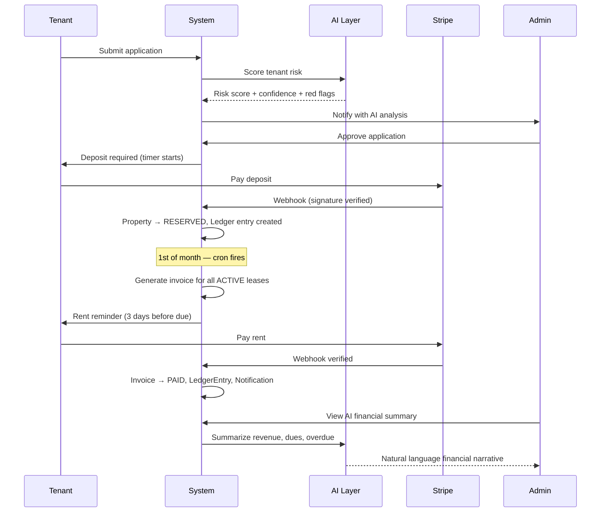

<div align="center">


</div>

<div align="center">


</div>

<br/>

<div align="center">

[](https://nandu-portfolio-three.vercel.app)
[](https://linkedin.com/in/nandu-panakanti-41839731a)
[](mailto:panakantinandu@gmail.com)
[](https://leetcode.com/u/Nandupanak/)

</div>

---

## ⚡ What I Build

```
┌─────────────────────────────────────────────────────────────────────┐
│                                                                     │
│   AI-Powered Platforms   →   PropMind, AI Workflow Automation       │
│   Distributed Systems    →   Kafka, BullMQ, Redis, Event-Driven     │
│   Production SaaS        →   LeaseHub, Multi-Tenant, Stripe         │
│   Cloud Security         →   AWS IAM Drift Detection, Lambda        │
│   ML Engineering         →   SHAP, Attrition Prediction, Explainable│
│                                                                     │
└─────────────────────────────────────────────────────────────────────┘
```

> Business logic belongs in code — not spreadsheets, not reminders, not trust.  
> I design backend-first systems where payments are verifiable, workflows are automated, and failures are traceable.

---

## 🛠️ Tech Stack

<div align="center">

**Languages**


**Backend & APIs**


**Databases**


**AI & Data**


**Cloud & DevOps**


**Frontend**


</div>

---

## 🚀 Projects

### 🏠 PropMind — AI-Powered Property Management Platform
> `Node.js` `Express` `MongoDB` `OpenAI API` `Stripe` `BullMQ` `Redis` `Socket.io`

**The problem:** Property management is full of manual steps — approving applications, chasing rent, triaging maintenance. PropMind replaces every manual step with code.



**What's under the hood:**

| Layer | What it does |
|---|---|
| 🤖 AI Risk Scoring | Evaluates income, rent-to-income ratio, payment history → risk score + confidence |
| 🔧 Maintenance Triage AI | Classifies ticket category (plumbing/electrical/HVAC), sets priority automatically |
| 💬 AI Support Assistant | Natural-language queries on live DB data — both admin and tenant facing |
| 📊 AI Financial Summary | Narrative of revenue, dues, and overdue tenants generated on demand |
| ⏱️ Automated Enforcement | Cron: cancel unpaid deposits, expire stale applications, apply late fees |
| 🧾 Ledger-based Billing | Every transaction creates a traceable double-entry ledger record |
| 🔒 Production Security | CSRF, Helmet, rate limiting, Mongo sanitize, Stripe webhook signature verification |

[](https://propmind-6mkn.onrender.com)
[](https://propmind-tenant.onrender.com)
[](https://github.com/panakantinandu/PropMind)

---

### ⚙️ AI Workflow Automation Platform
> `FastAPI` `PostgreSQL` `React` `LLM APIs` `Prompt Engineering`

An orchestration engine that lets you define, schedule, and monitor AI-powered workflows without writing a new pipeline each time.

```
User defines workflow
        │
        ▼
┌──────────────────────┐
│  Workflow Scheduler  │  ← PostgreSQL-backed task queue
└──────────┬───────────┘
           │
    ┌──────▼──────┐
    │  Execution  │  ← Retry handling, observability
    │   Engine    │
    └──────┬──────┘
           │
    ┌──────▼──────────────┐
    │   LLM Integration   │  ← Prompt-driven decision nodes
    └──────┬──────────────┘
           │
    ┌──────▼──────┐
    │  Analytics  │  ← Pipeline metrics, execution history
    └─────────────┘
```

[](https://github.com/panakantinandu)

---

### 🏢 LeaseHub — Multi-Tenant SaaS Platform
> `Node.js` `Express.js` `React` `MongoDB` `Docker` `Stripe`

Production-grade SaaS. Multi-tenant isolation, Stripe payments, event-driven payment webhooks, full CI/CD. Zero manual invoicing.

[](https://github.com/panakantinandu)
[](https://github.com/panakantinandu)

---

### 📡 Distributed Notification System
> `Spring Boot` `Apache Kafka` `Redis` `PostgreSQL`

Event-driven messaging pipeline with producer/consumer services, dead-letter queues, retry mechanisms, and fault-tolerant asynchronous processing at scale.

```
Producer Service  →  Kafka Topic  →  Consumer Service
                          │
                    Dead Letter Queue (on failure)
                          │
                    Retry Worker  →  Resolved / Alerting
```

---

### 🔐 AWS IAM Drift Detection
> `AWS Lambda` `EventBridge` `CloudTrail` `DynamoDB`

Real-time cloud security monitor. Detects privilege escalation and unexpected IAM changes across an AWS environment the moment they happen — not the next morning.

[](https://github.com/panakantinandu)

---

### 📊 Employee Attrition Prediction System
> `Python` `Scikit-learn` `SHAP` `Streamlit`

End-to-end ML pipeline: preprocessing → feature engineering → model training → SHAP-based explainability → interactive Streamlit dashboard. Not just predictions — transparent reasoning.

[](https://github.com/panakantinandu)

---

## 📈 GitHub Activity

<div align="center">


</div>

<div align="center">


</div>

<div align="center">


</div>

---

## 🏆 Certifications

<div align="center">


</div>

---

## 💡 Engineering Philosophy

```javascript
const nandu = {
  focus:      ["backend-first", "systems thinking", "production-grade"],
  avoids:     ["CRUD apps with no real logic", "trust over automation"],
  believes:   "business rules should be enforced by code, not people",
  currentlyImproving: ["DSA patterns", "system design at scale", "distributed tracing"],
  openTo:     "SWE roles — backend, AI systems, platform engineering"
};
```

---

<div align="center">


<br/>

[](https://linkedin.com/in/nandu-panakanti-41839731a)

<br/>


</div>
